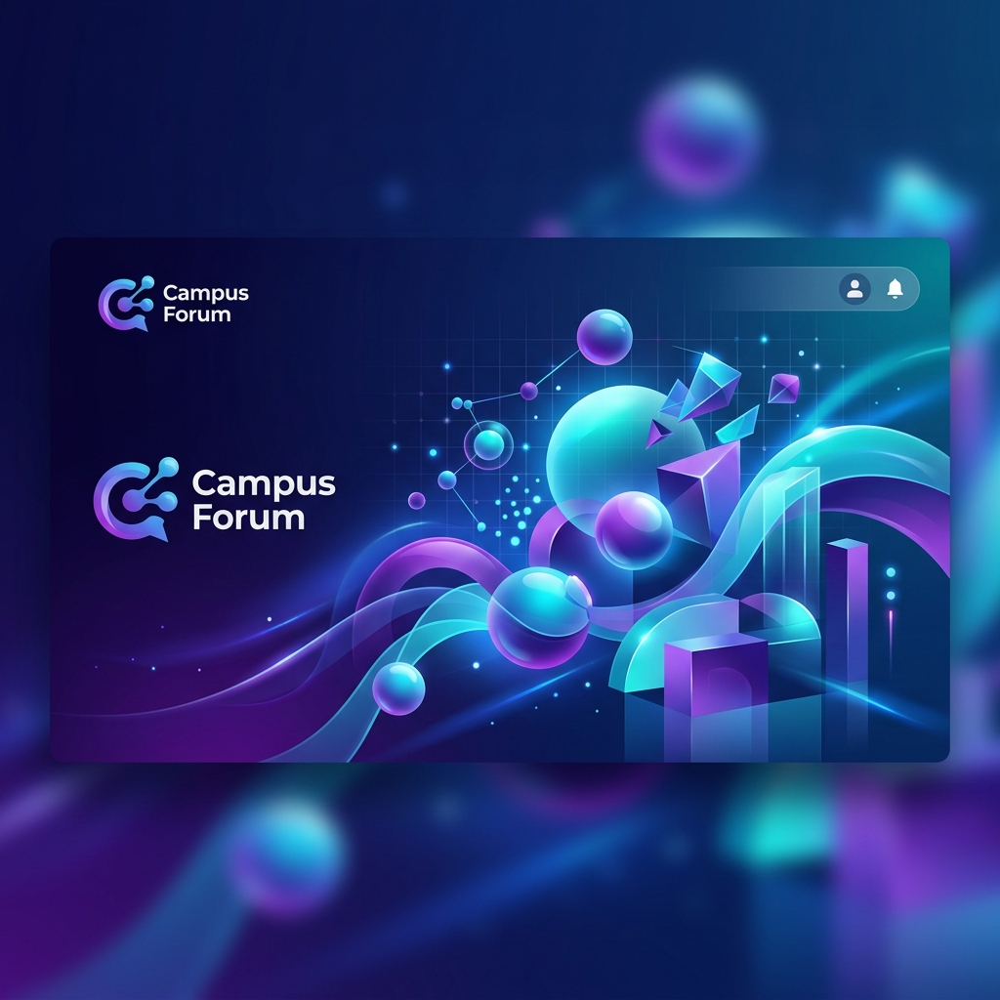
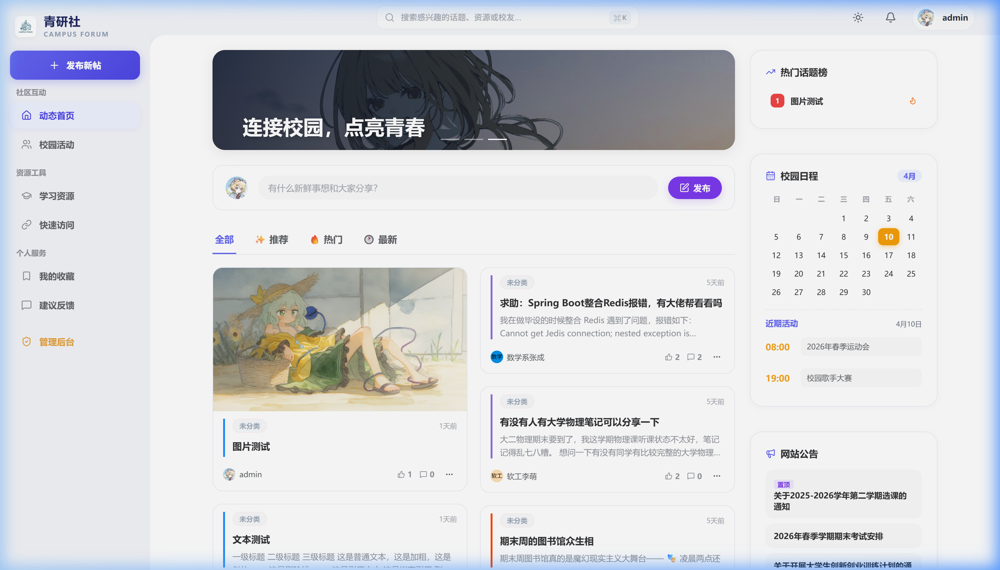
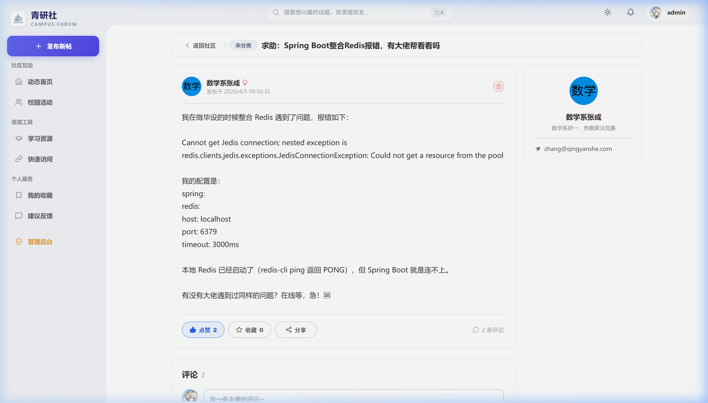
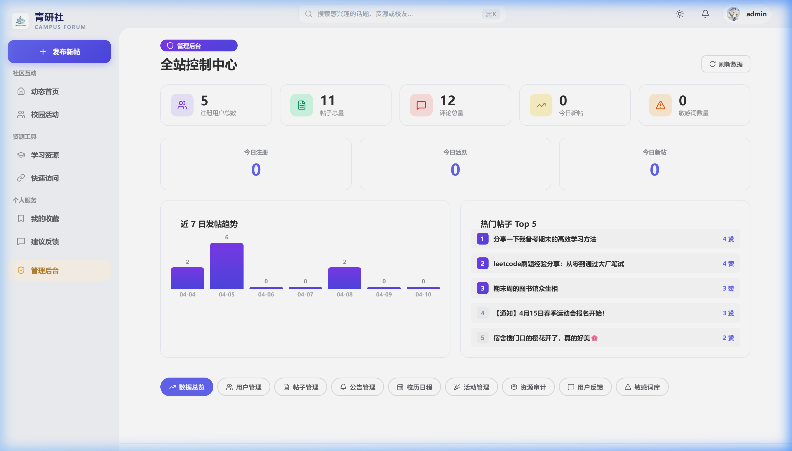
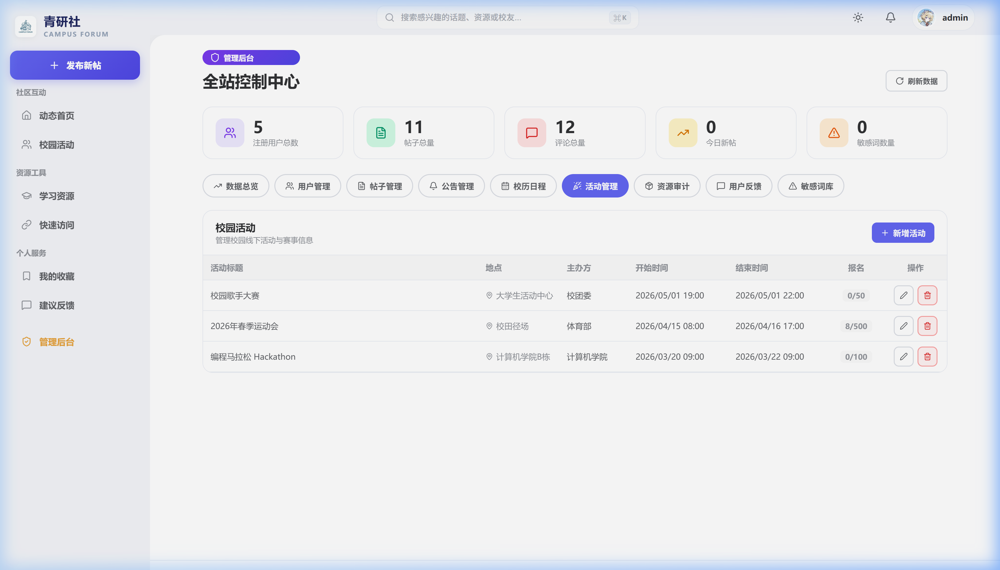
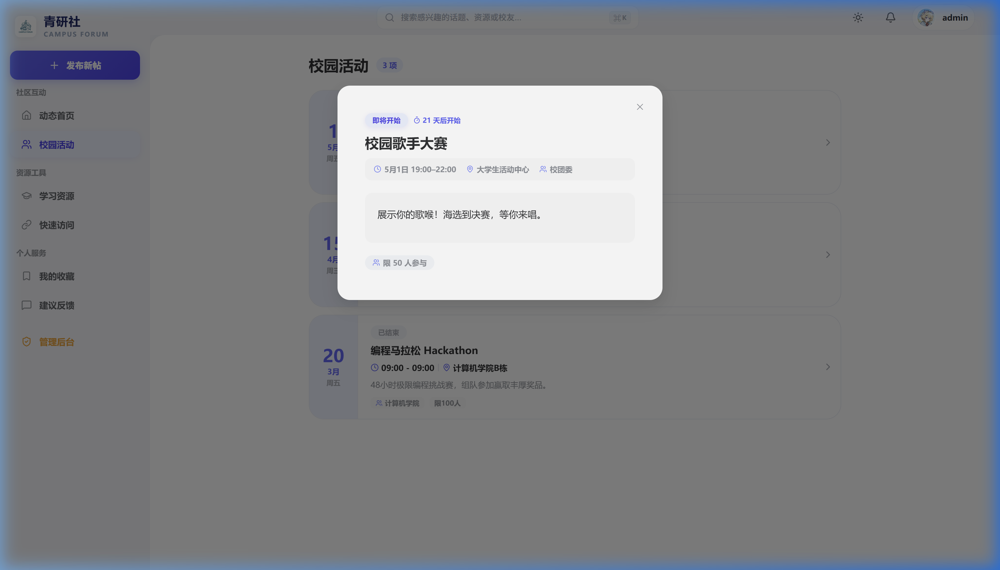

# 🏫 Campus Forum | 校园论坛系统



一个基于 Spring Boot + Vue 3 开发的高颜值、功能完备的校园社区交流平台。旨在为在校学生提供一个安全、高效、美观的交流环境，支持话题讨论、活动报名、资源分享及全方位的管理后台。

---

## ✨ 核心特性

### 🌐 社区互动
- **动态话题**：支持多标签、Markdown 渲染、代码高亮。
- **互动体验**：实时评论回复、点赞、收藏功能。
- **标签系统**：动态分类标签，快速定位感兴趣的内容。

### 📅 校园生活
- **活动中心**：发布校内讲学、赛事、社团活动，支持在线报名及名额管理。
- **智能校历**：学期重要事件、考试周、放假安排一目了然。

### 🛡️ 管理后台 (Admin)
- **多级权限**：超级管理员、内容管理员、版主三级权限体系。
- **内容审计**：发帖/评论审核流，敏感词自动过滤与库管理。
- **全量监控**：用户行为封禁、资源审计、以及数据仪表盘实时统计。

### 💎 高级视觉
- **现代 UI**：基于 Element Plus 的深度定制，结合 Lucide 图标库。
- **沉浸体验**：Premium 级别的视觉重构（活动页、管理后台等），支持圆角柔化与磨砂玻璃质感。

---

## 🛠️ 技术栈

### 后端 (Backend)
- **核心框架**: Java 17 + [Spring Boot 3](https://spring.io/projects/spring-boot)
- **安全认证**: [Spring Security](https://spring.io/projects/spring-security) + JWT
- **持久层**: [MyBatis Plus](https://baomidou.com/)
- **数据库**: [MySQL 8.0](https://www.mysql.com/) + [Redis](https://redis.io/) (缓存与限流)
- **其它**: Maven, Lombok, JavaMail

### 前端 (Frontend)
- **核心框架**: [Vue 3](https://vuejs.org/) + [Vite](https://vitejs.dev/)
- **状态管理**: [Pinia](https://pinia.vuejs.org/)
- **UI 组件**: [Element Plus](https://element-plus.org/)
- **图标**: [Lucide Vue Next](https://lucide.dev/)
- **网络请求**: Axios

---

## 🚀 快速开始

### 1. 环境准备
- MySQL 8.0+
- Redis 6.0+
- JDK 17+
- Node.js 18+

### 2. 数据库初始化
在 MySQL 中创建数据库 `campus_forum`，并依次执行以下脚本：
1. `init.sql` (基础结构)
2. `new_tables.sql` (扩展功能)
3. `admin_fix_patch.sql` (管理后台修复补丁)

### 3. 运行后端
```bash
cd finished-backend
# 配置 application.yaml 中的数据库和邮件信息
mvn spring-boot:run
```

### 4. 运行前端
```bash
cd finished-frontend
npm install
npm run dev
```

---

## 📸 项目预览

### 🏠 社区首页与帖子详情
社区列表支持多卡片布局，帖子详情支持 Markdown 渲染。
<table>
  <tr>
    <td width="50%"></td>
    <td width="50%"></td>
  </tr>
</table>

### 🛡️ 管理后台
全方位的管理功能，包含数据总览与活动审计。
<table>
  <tr>
    <td width="50%"></td>
    <td width="50%"></td>
  </tr>
</table>

### 💎 活动详情 (Premium UI)
沉浸式的活动展示页面。


---

## 📄 开源协议
本项目遵循 MIT 协议。
